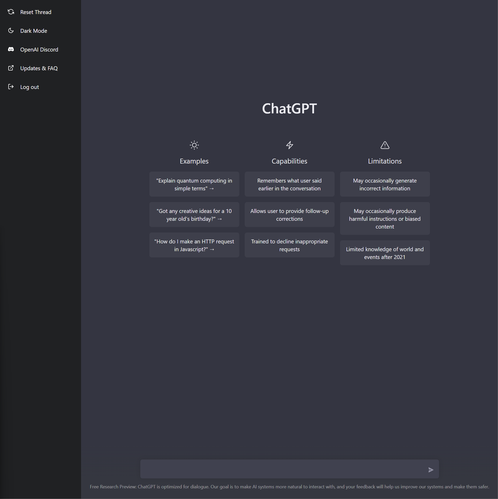
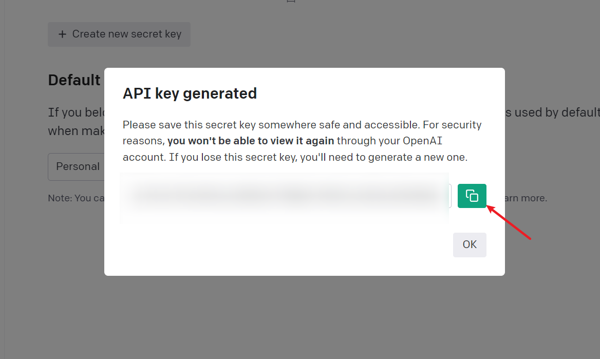

# ChatGPT-BOT

ChatGPT-BOT 是通过模拟请求调用 `chatGPT` 接口的小 `demo`。


## 思路

总体的一个思路，即 抓包 + `HTTP` 请求。

## 目前功能

- 通过 session_token 进行 初始化 `chatGPT`
- `chatGPT` 聊天

## 如何使用

### 安装依赖

项目根目录，执行 `npm install`
```bash
npm install
```
### 修改 secret.json

修改 `secret.json`, 带上你的 `sessionToken`。

1. 前往 <https://chat.openai.com/chat> 并登陆。
 
1. 按下 F12 打开开发者工具.
2. 点击 Application 选项卡 > Cookies.
   
3. 复制 \_\_Secure-next-auth.session-token 的值，并且以如下方式配置到您的项目中：

```json
{
  "authorization": "Bearer exxxxx"
}

```

### 运行程序
项目根目录，执行 `npm run start`
```
npm run start
```

你可以通过下方的 curl 测试下
```bash
curl --location --request POST 'http://localhost:3000/bot/chat' \
--header 'Content-Type: application/json' \
--data-raw '{
   "question": "测试一下"   
}'
```

## 未来 TODO
- `chatGPT`  刷新 token
- 通过 用户名，密码 初始化 `chatGPT`


