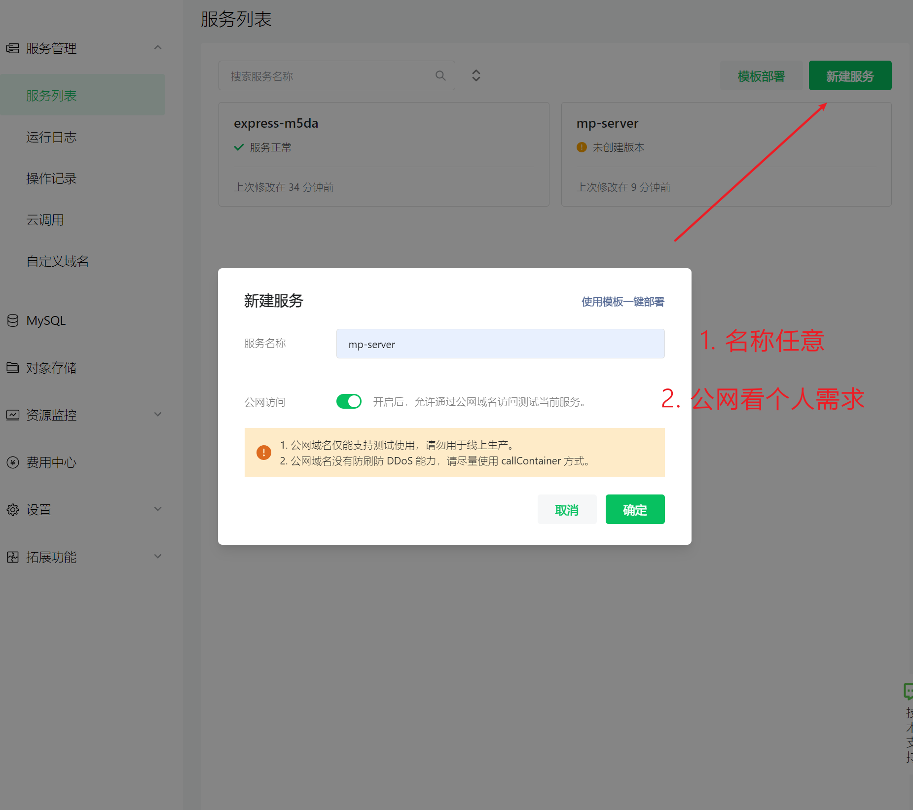
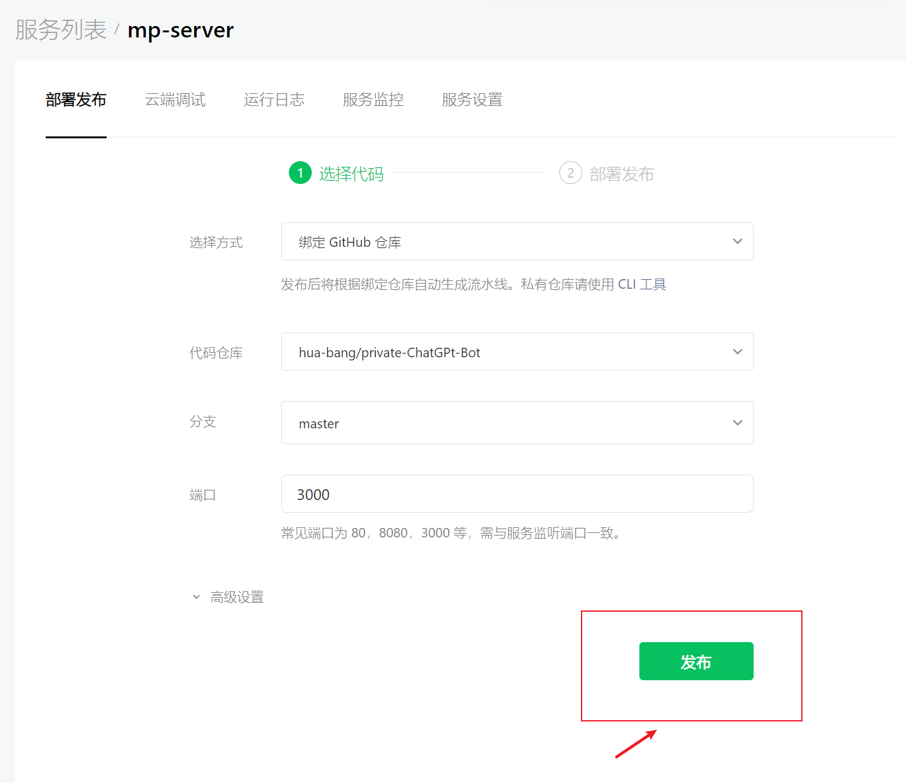
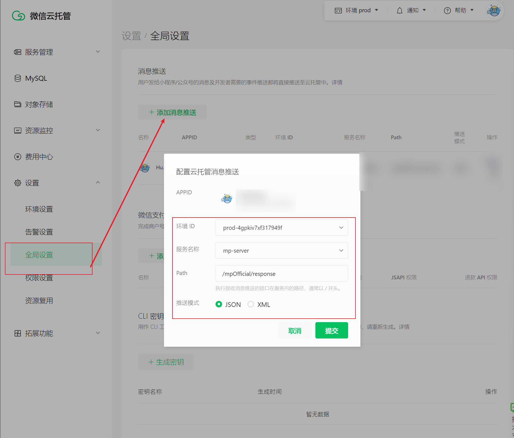
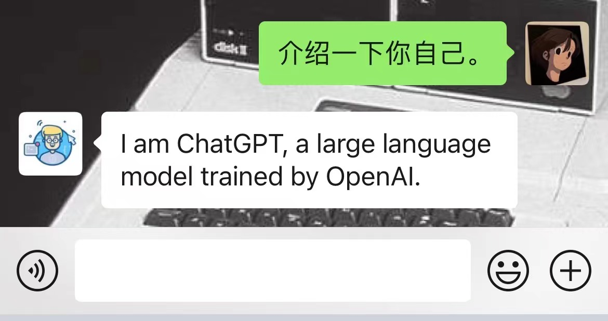

# ChatGPT-BOT

ChatGPT-BOT 是通过调用 `chatGPT` 开放的 [completions](https://platform.openai.com/docs/api-reference/completions) 接口的从而实现的小 `demo`。

## 目前功能

- 通过 `OPENAI_API_KEY` 进行 初始化 `chatGPT` 机器人。
- 微信公众号文字信息回复接入。

## 如何使用

> 目前支持的服务：
> - `ChatGPT` 聊天服务
> - 微信公众号接入服务

下面会讲这两个服务的接入方式

### ChatGpt 聊天服务

#### 安装依赖

项目根目录，执行 `npm install`, 同时全局安装 `ts-node`
```bash
npm install && npm install ts-node -g
```


#### 修改 env 下的 OPENAI_API_KEY

修改 `env`, 文件下的 `OPENAI_API_KEY`。

1. 前往 <https://platform.openai.com/account/api-keys> 并登陆，获取密钥。
 

2. 复制得到的密钥。
   。
3. 并且以如下方式配置到您的项目中：

```txt
OPENAI_API_KEY=xxxxx
```

#### 运行程序
项目根目录，执行 `npm run start`
```
npm run start
```

你可以通过下方的 `curl` 测试下

```bash
curl --location --request POST 'http://localhost:3000/bot/chat' \
--header 'Content-Type: application/json' \
--data-raw '{
   "question": "测试一下"   
}'
```

### 微信公众号接入

> 前置条件:
> - 已注册了微信公众号。https://mp.weixin.qq.com/
> - 公众号开启了微信云托管服务。https://cloud.weixin.qq.com/cloudrun

#### 新建服务

进入[云托管控制台](https://cloud.weixin.qq.com/cloudrun/console), 点击新建服务，输入服务名称和公网访问，创建新服务即可。



#### 部署发布

部署发布
你可以通过 fork [GitHub - hua-bang/chatGPT-bot](https://github.com/hua-bang/chatGPT-bot) 这个仓库，新建你的个人仓库(建议设为私有仓库)。

- **选择方式**：绑定 Github 仓库
- **代码仓库**：fork 后的仓库
- **分支**：master(如果你不改新分支, 默认 master 就好)。
- **端口**：3000(如果你不改新分支, 默认 3000 就好)。
- **注意**： fork 后的代码需要修改 **env** 下的 **OPENAI_API_KEY**。



待部署成功。

#### 配置信息推送

最后一步，是公众号配置信息推送。
**按下图点击，并打开配置框**：
- **环境 ID**：当前微信云托管的 id。
- **服务名称**：上一步创建的服务名称。
- **PATH**：/mpOfficial/response (如果你不改代码, 默认就是这个)。
- **推送模式**： 仅支持 JSON。



#### 验证程序

找对应的公众号，进行回复测试即可啦。



## 参考
- [Github-chatgpt-api](https://github.com/transitive-bullshit/chatgpt-api)
- [completions](https://platform.openai.com/docs/api-reference/completions)


